# Jarkom_Modul5_Lapres_A02
Lapres Jarkom Modul 5 A02

## A Membuat Topologi Jaringan
Membuat file topologi.sh
~~~
uml_switch -unix switch1 > /dev/null < /dev/null &
uml_switch -unix switch2 > /dev/null < /dev/null &
uml_switch -unix switch3 > /dev/null < /dev/null &
uml_switch -unix switch4 > /dev/null < /dev/null &
uml_switch -unix switch5 > /dev/null < /dev/null &
uml_switch -unix switch6 > /dev/null < /dev/null &

xterm -T SURABAYA -e linux ubd0=SURABAYA,jarkom umid=SURABAYA eth0=tuntap,,,10.151.72.13 eth1=daemon,,,switch1 eth2=daemon,,,switch2 mem=96M &
xterm -T BATU -e linux ubd0=BATU,jarkom umid=BATU eth0=daemon,,,switch1 eth1=daemon,,,switch3 eth2=daemon,,,switch5 mem=96M &
xterm -T KEDIRI -e linux ubd0=KEDIRI,jarkom umid=KEDIRI eth0=daemon,,,switch2 eth1=daemon,,,switch6 eth2=daemon,,,switch4 mem=96M &

xterm -T MALANG -e linux ubd0=MALANG,jarkom umid=MALANG eth0=daemon,,,switch3 mem-128M &
xterm -T MOJOKERTO -e linux ubd0=MOJOKERTO,jarkom umid=MOJOKERTO eth0=daemon,,,switch3 mem=128M &
xterm -T PROBOLINGGO -e linux ubd0=PROBOLINGGO,jarkom umid=PROBOLINGGO eth0=daemon,,,switch4 mem=128M &
xterm -T MADIUN -e linux ubd0=MADIUN,jarkom umid=MADIUN eth0=daemon,,,switch4 mem=128M &

xterm -T SIDOARJO -e linux ubd0=SIDOARJO,jarkom umid=SIDOARJO eth0=daemon,,,switch5 mem=96M &
xterm -T GRESIK -e linux ubd0=GRESIK,jarkom umid=GRESIK eth0=daemon,,,switch6 mem=96M &
~~~

## B Sunetting
Di sini kami menggunakan teknik CIDR untuk subnettingnya.
1. Menentukan subnet yang ada dalam topologi dan melakukan labelling netmask terhadap masing-masing subnet. Hasilnya ada pada gambar berikut. 
    
    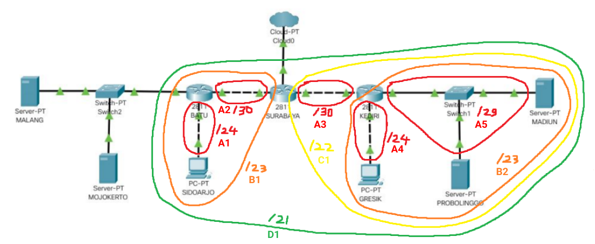
2. Dari proses penggabungan yang telah dilakukan, didapatkan sebuah subnet besar yang memiliki NID **192.168.0.0 dengan netmask /21**.
3. Selanjutnya menghitung pembagian IP dengan pohon berdasarkan penggabungan subnet yang telah dilakukan. 
    
    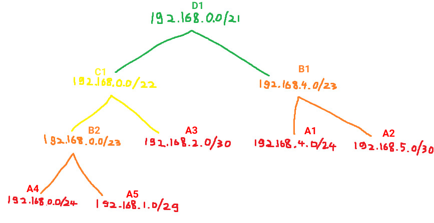
4. Mengatur IP untuk masing-masing interface yang ada di setiap device sesuai dengan pembagian subnet pada pohon CIDR.
      1. IP pada INTERFACE MALANG
          
          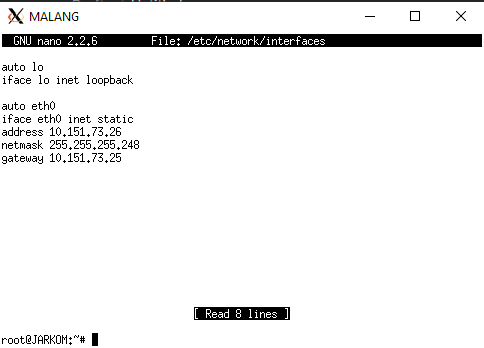
          
          Keterangan:
          - eth0: Mengarah ke BATU
      2. IP pada INTERFACE MOJOKERTO
         
         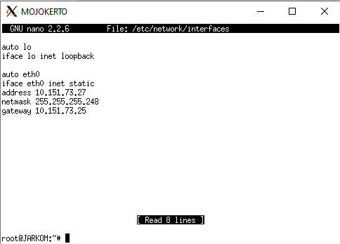
         
          Keterangan:
          - eth0: Mengarah ke BATU
          
      3. IP pada INTERFACE BATU
         
         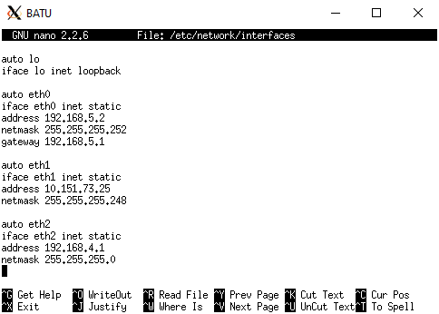
          
          Keterangan:
          - eth0: Mengarah ke SURABAYA
          - eth1 menuju MALANG dan MOJOKERTO
          - eth2 menuju SIDOARJO

      4. IP pada INTERFACE SURABAYA
          
         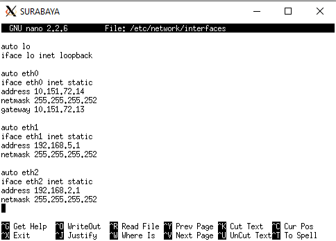
          
          keterangan:
          - eth0 menuju CLOUD
          - eth1 menuju BATU
          - eth2 menuju KEDIRI
          
      5. IP pada INTERFACE KEDIRI
          
         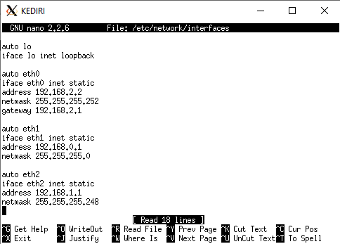
         
         keterangan:
          - eth0 menuju SURABAYA
          - eth1 menuju GRESIK
          - eth2 menuju MADIUN dan PROBOLINGGO
                  
      6. IP pada INTERFACE PROBOLINGGO
         
         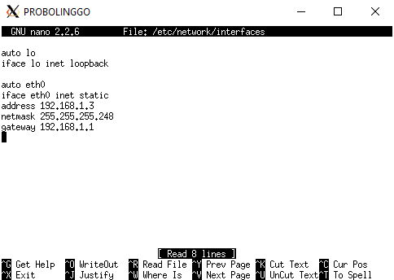
         
         keterangan:
          - eth0 menuju KEDIRI
          
      7. IP pada INTERFACE MADIUN
         
         
         
         keterangan:
         - eth0 menuju KEDIRI
         
Untuk pemberian IP pada client, akan dijelaskan pada poin D.
5. Menyalakan IPv4 forwarding pada setiap router. Sebagai contoh di SURABAYA.
    
   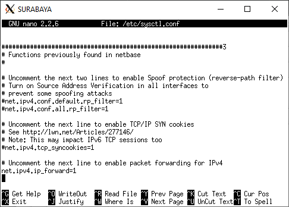         

## C Routing
Melakukan routing hanya pada router SURABAYA saja, router lain (BATU dan KEDIRI) tidak memerlukan routing karena sudah dilakukan default routing.

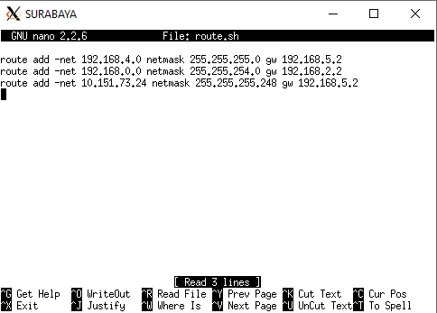

keterangan:
  - routing pertama adalah routing ke A1
  - routing kedua adalah routing ke B2
  - routing ketiga adalah routing ke MALANG dan MOJOKERTO

## D DHCP
1. Menginstall isc-dhcp-relay di BATU dan KEDIRI.
2. Menambahkan IP MOJOKERTO pada "SERVERS" di file **/etc/default/isc-dhcp-relay** sehingga menjadi `SERVERS="10.151.73.27"`.
3. Meninstall isc-dhcp-server di MOJOKERTO.
4. mengosongkan INTERFACES="" pada file **/etc/default/isc-dhcp-server** di MOJOKERTO.
5. Melakukan konfigurasi DHCP berikut pada file **/etc/dhcp/dhcpd.conf** di MOJOKERTO.
~~~
subnet 192.168.4.0 netmask 255.255.255.0 {
        range 192.168.4.2 192.168.4.254;
        option routers 192.168.4.1;
        option broadcast-address 192.168.4.255;
        option domain-name-servers 10.151.73.26;
        default-lease-time 600;
        max-lease-time 7200;
}

subnet 192.168.0.0 netmask 255.255.255.0 {
        range 192.168.0.2 192.168.0.254;
        option routers 192.168.0.1;
        option broadcast-address 192.168.0.255;
        option domain-name-servers 10.151.73.26;
        default-lease-time 600;
        max-lease-time 7200;
}

subnet 10.151.73.24 netmask 255.255.255.248 {
}
~~~

Keterangan:
1. Subnet pertama adalah subnet SIDOARJO
      - Range diisi sesuai dengan perhitungan subnetting CIDR sehingga mendapatkan IP antara 192.168.4.2 sampain 192.168.4.254
      - Routers berisi IP Gateway dari router terdekat menuju SIDOARJO sehingga diisi eth2 BATU
      - Broadcast-address adalah IP terakhir dari subnet
      - Doman-name-servers diisi IP MALANG karena MALANG adalah DNS Server
2. Subnet kedua adalah subnet GRESIK
      - Range diisi sesuai dengan perhitungan subnetting CIDR sehingga mendapatkan IP antara 192.168.0.2 sampain 192.168.0.254
      - Routers berisi IP Gateway dari router terdekat menuju GRESIK sehingga diisi eth1 KEDIRI
      - Broadcast-address adalah IP terakhir dari subnet
      - Doman-name-servers diisi IP MALANG karena MALANG adalah DNS Server
6. Menambahkan konfigurasi interface pada SIDOARJO dan GRESIK.
    - INTERFACE SIDOARJO
            
      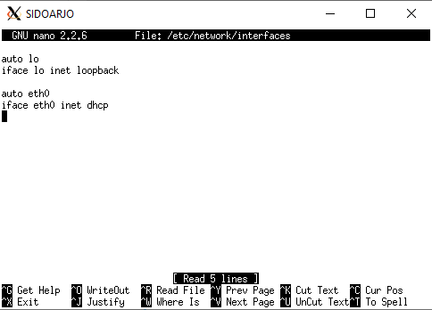
    
    - INTERFACE GRESIK
            
      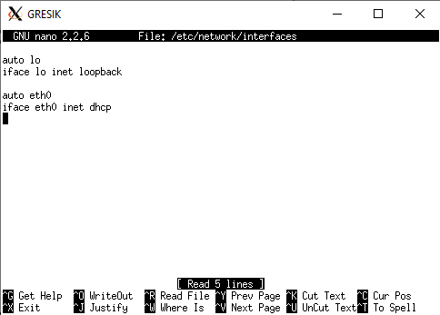

## Soal 1
Diminta untuk mengkonfigurasi SURABAYA menggunakan iptables, namun tidak diperbolehkan menggunakan MASQUERADE.
### Jawab
Menambahkan konfigurasi iptables berikut di SURABAYA.
~~~
iptables -t nat -A POSTROUTING -s 192.168.0.0/16 -o eth0 -j SNAT --to-source 10.151.72.14
~~~
Keterangan:

## Soal 2
Diminta untuk mendrop semua akses SSH dari luar Topologi (UML) pada server
yang memiliki IP DMZ (DHCP dan DNS SERVER) pada SURABAYA
### Jawab
Menambahkan konfigurasi iptables berikut di SURABAYA.
~~~
iptables -A FORWARD -p tcp --dport 22 -d 10.151.73.24/29 -i eth0 -j DROP
~~~
Keterangan:

## Soal 3
Membatasi DHCP
dan DNS server hanya boleh menerima maksimal 3 koneksi ICMP secara bersamaan yang berasal dari
mana saja menggunakan iptables pada masing masing server, selebihnya akan di DROP.
### Jawab
Menambahkan konfigurasi iptables berikut di MALANG dan MOJOKERTO.
~~~
iptables -A INPUT -p icmp -m connlimit --connlimit-above 3 --connlimit-mask 0 -j DROP
~~~
Keterangan:

# Soal 4 dan Soal 5
Membatasi akses ke MALANG yang berasal dari SUBNET
SIDOARJO dan SUBNET GRESIK.
## Soal 4
Akses dari subnet SIDOARJO hanya diperbolehkan pada pukul 07.00-17.00 pada hari Senin sampai Jumat.
### Jawab
Menambahkan konfigurasi iptables berikut di MALANG.
~~~
iptables -A INPUT -s 192.168.4.0/24 -m time --timestart 07:00 --timestop 17:00 --weekdays Mon,Tue,Wed,Thu,Fri -j ACCEPT
~~~
Keterangan:

## Soal 5
Akses dari subnet GRESIK hanya diperbolehkan pada pukul 17.00 hingga pukul 07.00 setiap
harinya.
### Jawab
Menambahkan konfigurasi iptables berikut di MALANG.
~~~
iptables -A INPUT -s 192.168.0.0/24 -m time --timestart 17:00 --timestop 00:00 -j ACCEPT
iptables -A INPUT -s 192.168.0.0/24 -m time --timestart 00:00 --timestop 08:00 -j ACCEPT
~~~
Keterangan:

Terakhir menambahkan konfigurasi iptables berikut di MALANG.
~~~
iptables -A INPUT -s 192.168.4.0/24 -j REJECT
iptables -A INPUT -s 192.168.0.0/24 -j REJECT
~~~

## Soal 6
SURABAYA disetting sehingga setiap
request dari client yang mengakses DNS Server akan didistribusikan secara bergantian pada
PROBOLINGGO port 80 dan MADIUN port 80.
### Jawab
Pertama adalah membuat domain (DNS) yang mengarah ke IP random (dalam hal ini 192.168.6.1).

Konfigurasi pada file **/etc/bind/named.conf.local** MALANG
~~~
zone "jarkom.com" {
        type master;
        file "/etc/bind/jarkom/jarkom.com";
};
~~~

Konfigurasi pada file **/etc/bind/jarkom/jarkom.com** MALANG
~~~
$TTL    604800
@       IN      SOA     jarkom.com. root.jarkom.com. (
                        2020122104      ; Serial
                         604800         ; Refresh
                          86400         ; Retry
                        2419200         ; Expire
                         604800 )       ; Negative Cache TTL
;
@       IN      NS      jarkom.com.
@       IN      A       192.168.6.1
~~~

Setelah itu menambahkan konfigurasi iptables berikut di SURABAYA.
~~~
iptables -A PREROUTING -t nat -p tcp -d 192.168.6.1 --dport 80 -m statistic --mode nth --every 2 --packet 0 -j DNAT --to-destination 192.168.1.2:80
iptables -A PREROUTING -t nat -p tcp -d 192.168.6.1 --dport 80 -j DNAT --to-destination 192.168.1.3:80
iptables -t nat -A POSTROUTING -p tcp -d 192.168.1.2 --dport 80 -j SNAT --to-source 192.168.6.1:80
iptables -t nat -A POSTROUTING -p tcp -d 192.168.1.3 --dport 80 -j SNAT --to-source 192.168.6.1:80
~~~
Keterangan:

## Soal 7
Semua paket didrop oleh firewall (dalam topologi) tercatat dalam log pada setiap
UML yang memiliki aturan drop.
### Jawab
Menambahkan konfigurasi iptables berikut di SURABAYA.
~~~
iptables -N LOGGING
iptables -A FORWARD -p tcp --dport 22 -d 10.151.73.24/29 -i eth0 -j LOGGING
iptables -A LOGGING -m limit --limit 2/min -j LOG --log-prefix "DROP: " --log-level info
iptables -A LOGGING -j DROP
~~~
Keterangan:

Menambahkan konfigurasi iptables berikut di MALANG.
~~~
iptables -A LOGGING -m limit --limit 2/min -j LOG --log-prefix "DROP: " --log-level info
iptables -A LOGGING -j DROP
~~~
Keterangan:

Menambahkan konfigurasi iptables berikut di MOJOKERTO.
~~~
iptables -A LOGGING -m limit --limit 2/min -j LOG --log-prefix "DROP: " --log-level info
iptables -A LOGGING -j DROP
~~~
Keterangan:

